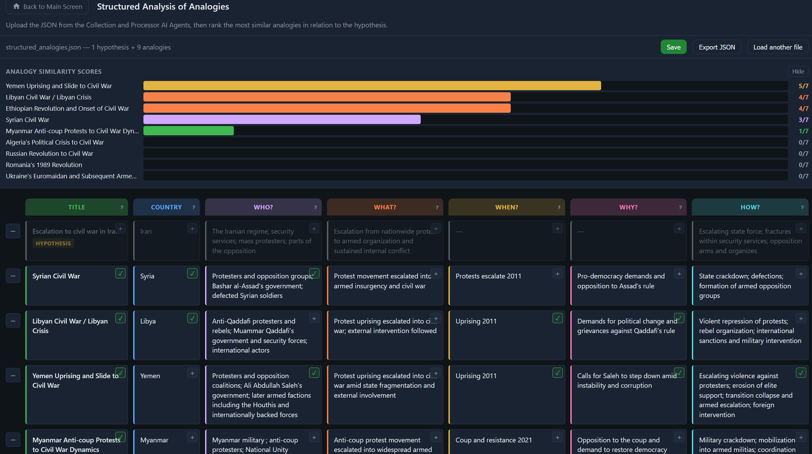

# Structured Analysis of Analogies


*Kanban-style board for ranking historical analogies against a hypothesis.*

## Overview

Structured Analysis of Analogies is a browser-based tool that helps analysts compare historical events to a working hypothesis using a systematic, side-by-side approach. It is designed for use after AI-assisted collection and processing of analogy candidates.

The tool displays each analogy as a horizontal row on a kanban board with seven structured fields: **Title**, **Country**, **Who**, **What**, **When**, **Why**, and **How**. Analysts score each field for similarity to the hypothesis, producing a ranked list of the most relevant analogies.

## How It Works

1. **Upload** a JSON file generated by the Collection and Processor AI Agents.
2. The first entry is automatically treated as the **Hypothesis** and visually distinguished from the analogies.
3. **Score** each analogy field by clicking the `+` button — each field can receive one point (max 7 per analogy).
4. The **Analogy Similarity Scores** scoreboard ranks all analogies by total score.
5. Click any row to open a **detail view** showing full text, sources, and an editable notes field.
6. **Save** to overwrite the original JSON with scores and notes, or **Export JSON** for a lightweight version without sources.

## Features

- Kanban board with color-coded columns for quick visual scanning
- Per-field similarity scoring with a live-updating scoreboard
- Collapsible rows to focus on specific analogies
- Detail popup with full event data, sources, and editable notes
- Column help buttons (`?`) describing the scoring question for each field
- Session persistence — page refreshes preserve the current state
- Save and export functionality for downstream analysis

## JSON Format 

The tool expects an array of objects. The first object is the hypothesis; all subsequent objects are analogies.

```json
[
  {
    "Title": "Hypothesis title",
    "Country": "Country",
    "WHO was the target?": "...",
    "WHAT happened?": "...",
    "WHEN did it happen?": "...",
    "WHY did this happen?": "...",
    "HOW did it happen?": "...",
    "Sources": ["https://..."],
    "Notes": ""
  }
]
```

## Screenshot

Save the UI screenshot as:

```
04-reframing/structured-analysis-of-analogies/assets/img/analogies-ui.png
```

## License

Part of the [Structured Analytic Techniques](../../README.md) toolkit.
