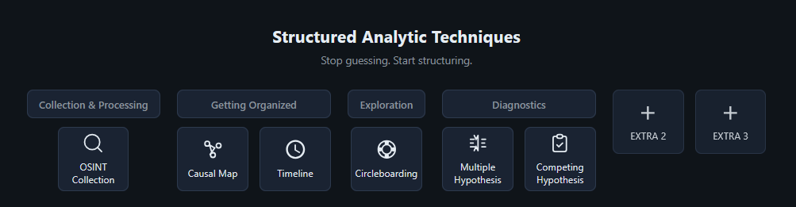

# Structured Analytic Techniques

A collection of lightweight, analyst-focused tools for Structured Analytic Techniques (SAT). All tools run in the browser and work offline where applicable.

## Quick start

From the repo root run:

```bash
node start-all.js
```

Then open **http://localhost:3000** in your browser. The hub shows one button per tool; each opens the tool in a new tab. Press Ctrl+C in the terminal to stop all servers.

Alternatively, run **`node server.js`** from the repo root for the same result.

**Note:** The folder structure supports only one information requirement task. To avoid collision between different analyses, it is suggested that once downloaded the whole repository is moved into a dedicated project folder (e.g. one folder per case or task).

## Screenshot (hub / main page)

  
*Main hub with tool launcher buttons.*

## Purpose

These tools support practical SAT workflows: they make assumptions, relationships, and timelines explicit and help reduce cognitive bias. They are aimed at exploratory analysis in complex, uncertain settings without heavy infrastructure.

  
*Structured Analytic Techniques for Intelligence Analysis — Richards J. Heuer Jr., Randolph H. Pherson*

## Tools

Tools are grouped by phase:

- **01 – Getting Organized:** Causal Map, Timeline  
- **02 – Exploration:** Circleboarding  
- **03 – Diagnostics:** Multiple Hypothesis Generation, Analysis of Competing Hypothesis (ACH)

| Tool | Port | Folder |
|------|------|--------|
| Causal Map | 8765 | `01-getting-organized/structured-analytic-causal-map` |
| Timeline | 8080 | `01-getting-organized/structured-analytic-timeline` |
| Circleboarding | 8082 | `02-exploration/structured-analytic-circleboarding` |
| Multiple Hypothesis Generation | 8083 | `03-diagnostics/structured-analytic-multiple-hypothesis-generation` |
| Analysis of Competing Hypothesis | 8084 | `03-diagnostics/structured-analysis-of-competing-hypothesis` |

- **Causal Map** — Causal/concept map editor. Renders a hierarchical dataset as an interactive node-link graph (SVG); add, edit, annotate nodes; pan & zoom; Float mode; JSON import/export.
- **Timeline** — Timeline of events (name, description, source, date/time). Scale range, zoom, Event Details; export to Indicators / hypothesis keywords (JSONL).
- **Circleboarding** — Kanban-style 5WH + “So what?” dashboard. Six category boxes and a 6-lane “So what?” area; loads from CircleboardData.txt or Indicators.txt; refresh to merge from other tools.
- **Multiple Hypothesis Generation** — Place candidate statements into Who? / What? / Why? columns and a Permutation area. Source list from Multiple_Hypothesis_Generation.txt (or add in-app); link from Circleboarding “Save for Hypothesis Generation”.
- **Analysis of Competing Hypothesis (ACH)** — Evidence list and matrix (evidence rows × hypothesis columns H1–H5), analysis notes, filter/sort; load/save JSON.

Port details: [HUB-PAGE-INSTRUCTIONS.md](HUB-PAGE-INSTRUCTIONS.md).
