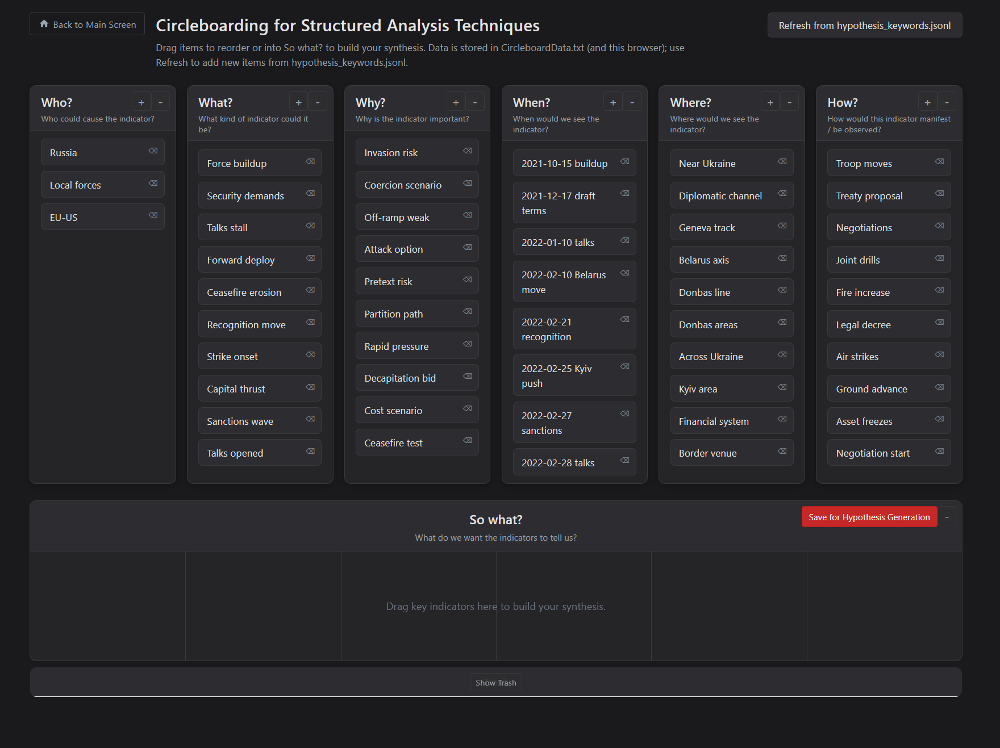

# Circleboarding

A **Kanban-style dashboard** for 5WH + “So what?” indicators. Six category boxes (Who?, What?, Why?, When?, Where?, How?) plus a 6-lane “So what?” area. Other modules (e.g. Timeline, Causal Map) export to **hypothesis_keywords.jsonl**; the circleboard keeps its own data in **CircleboardData.txt**.

## Screenshot

  
*5WH category boxes and "So what?" lanes.*

## Data files

- **CircleboardData.txt** – The app’s main data file (when the server is used). Loaded first on startup. All saves (drags, edits) write here and to the browser’s localStorage.
- **hypothesis_keywords.jsonl** – JSON Lines file produced by other tools. The circleboard **never overwrites** it. Use **Refresh from hypothesis_keywords.jsonl** to **merge** new keywords into the current board (existing items and “So what?” lanes are kept; only new items are appended per category).

## Load order

1. **CircleboardData.txt** – if present (when served by `node server.js`), loaded first.
2. **hypothesis_keywords.jsonl** – if CircleboardData.txt is missing or unavailable, used as initial data.
3. **localStorage** – if the app has been used before in this browser.
4. **Embedded fallback** – if nothing else is available (e.g. opening `index.html` via file://).

## Refresh

Click **Refresh from hypothesis_keywords.jsonl** to read the JSONL file and merge new keywords into the current state. New items are appended per category; existing items and “So what?” lanes are unchanged. Duplicates (same text in the same category) are skipped.

## Features

- Six category boxes and a 6-lane “So what?” area; drag between them and reorder within lanes.
- Persistence: localStorage plus **CircleboardData.txt** when the server is running (POST `/api/save-circleboard`).
- Inline edit (double-click) on items.

## Run locally

**From repo root:** Run `node start-all.js` and open the hub at http://localhost:3000, then click **Circleboarding** (port 8082).

- **With server (recommended):** run `node server.js` in this folder, then open **http://localhost:8082**. Data is read/written from **CircleboardData.txt**.
- **Without server:** open `index.html` (e.g. via file://). Data is kept in localStorage only; Refresh fetches **hypothesis_keywords.jsonl** when the page was loaded from a server.

## Port

This tool’s server uses **port 8082** (see repo root `HUB-PAGE-INSTRUCTIONS.md`).

## Files

- `index.html` – Dashboard and Refresh button.
- `styles.css` – Layout and styles.
- `app.js` – Load (CircleboardData.txt → hypothesis_keywords.jsonl), merge, save, drag-and-drop.
- `hypothesis_keywords.jsonl` – Produced by other modules; read-only for circleboard, merged in on Refresh.
- `CircleboardData.txt` – Created/updated by the app when the server is used.
- `server.js` – Static server + POST `/api/save-circleboard` to write CircleboardData.txt.
