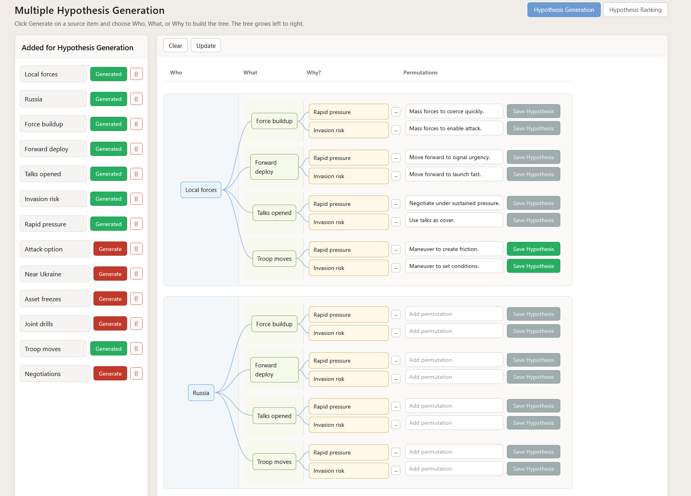
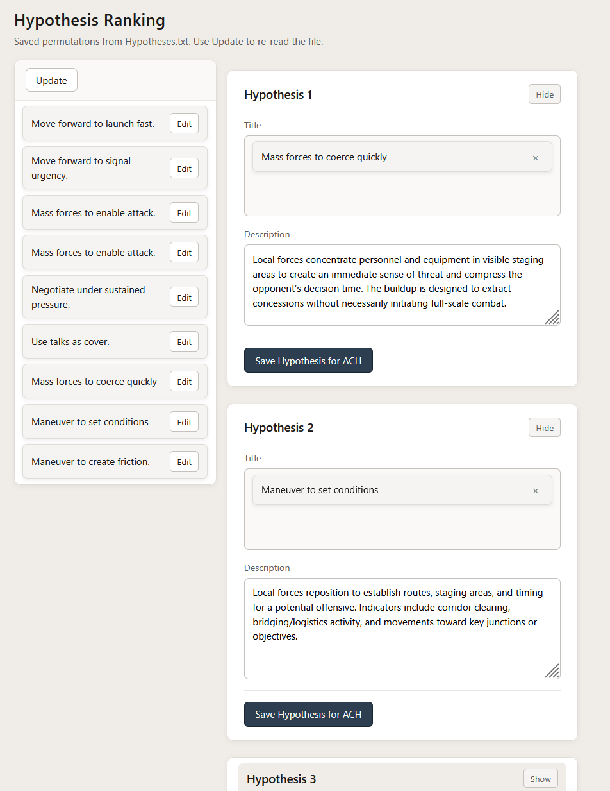

# Multiple Hypothesis Generation

This module has two main views, switched by the top buttons: **Hypothesis Generation** and **Hypothesis Ranking**.

- **Hypothesis Generation** — Build a tree from source items by choosing **Who?**, **What?**, or **Why?** for each. The left panel lists items from a source file; the right shows columns (Who → What → Why → Permutations) with drag-to-reorder and editable cards.
- **Hypothesis Ranking** — Rank and assign hypotheses into five slots (H1–H5). The left panel lists items from **Hypotheses.txt** (reorder by drag); the right shows five hypothesis cards. Drag items from the left into a card’s title area, edit descriptions, and use **Save Hypothesis for ACH** to export to the Structured Analysis of Competing Hypotheses module.

## Screenshots

**Hypothesis Generation** — Source list, tree workspace (Who / What / Why / Permutations), and Generate flow.

**Hypothesis Ranking** — Left list (Hypotheses.txt) and right-side H1–H5 cards with drag-and-drop and Save for ACH.

## Running the app

- **Via hub:** From the repo root run `node start-all.js`, then open the hub at **http://localhost:3000** and click the link to this app. The app runs on **http://localhost:8083** (port per `HUB-PAGE-INSTRUCTIONS.md`).
- **Standalone:** Run `node server.js` in this folder, then open **http://localhost:8083**. Do not open `index.html` via `file://` or the source file will not load.

## Data files

| File | Purpose |
|------|--------|
| **Multiple_Hypothesis_Generation.txt** | Source list for the **Hypothesis Generation** view. Each line (after stripping a leading `- `) is shown in the left panel as a row with a **Generate** button. Updated when you add items or when the Circleboarding app writes “Save for Hypothesis Generation”. |
| **Hypotheses.txt** | Source list for the **Hypothesis Ranking** view. Lines appear in the left panel; you reorder by drag and assign items to H1–H5 cards. The server overwrites this file when you remove items or reorder. |

## Hypothesis Generation workflow

1. **Source list (left):** Items from **Multiple_Hypothesis_Generation.txt** (and any you add with **Add +**) appear as rows with a **Generate** button. Use **Update** to re-read the file.
2. **Generate:** Click **Generate** on an item → popup asks **Who?**, **What?**, **Why?** (What and Why unlock after you have at least one Who or What). Choose one → the item becomes a card in that column.
3. **Tree:** Columns are Who → What → Why → **Permutations**. Cards can be dragged to reorder within a column; card text is editable. Use **Clear** to reset the tree and **Update** to propagate What/Why to new Who branches.
4. **Save:** Use **Save hypothesis** on a permutation row to send that hypothesis to the ranking list (and **Hypotheses.txt**).

## Hypothesis Ranking workflow

1. **Left list:** Loaded from **Hypotheses.txt**. Drag to reorder; use the edit (pencil) to change text or color, or the trash to delete (updates the file).
2. **Right cards (H1–H5):** Drag items from the left into a card’s **Title** drop zone. Optionally fill **Description** and use **Save Hypothesis for ACH** to write that hypothesis to the Structured Analysis of Competing Hypotheses module (`hypothesis.json`).
3. Cards can be collapsed/expanded with **Hide** / **Show**.

## Source of Multiple_Hypothesis_Generation.txt (optional)

1. Run the Circleboarding app from **structured-analytic-circleboarding** (`node server.js`, **http://localhost:8082**).
2. Add or drag items into the **So what?** section, then click **Save for Hypothesis Generation**.
3. The file is written here with a “So What?” header and `- item` lines.

## Port

This app’s server uses **port 8083** (see repo root `HUB-PAGE-INSTRUCTIONS.md`).
