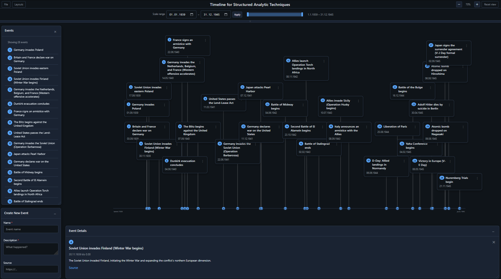

# Timeline for Structured Analytic Techniques

A lightweight, browser-based timeline tool for **Structured Analytic Techniques (SAT)**. Use it to capture events with context (what/why/who/where), attach sources, and analyze patterns over time using zoom, filtering, and a clean event-detail workflow. Runs fully in the browser (no backend required) and works offline.




---

## What it does

- Create timestamped events (**name, description, source, date, time**)
- Visualize events on a time axis with connectors and numbered dots
- Alternate event placement the timeline to improve readability
- Click events to open a dedicated **Event Details** panel
- Use a **scale range** to focus on a specific time window
- Zoom in/out to support analysis at different levels of detail
- Manage UI panels from **Layouts** (show/hide + reset layouts)
- Import/export events as **JSON** from **File**
- **Generate Hypothesis Keywords** (What / Who / When / Where / Why / How) from the toolbar or Evidence Details panel; append one JSON Lines (NDJSON) record to `hypothesis_keywords.jsonl` via optional server, or download one line as `.jsonl`

---

## Quick start

**From repo root:** Run `node start-all.js` and open the hub at http://localhost:3000, then click **Timeline** (port 8080).

### Run locally (Option 1: simplest)
1. Clone or download the repo  
2. Open `index.html` in your web browser

### Run locally (Option 2: local server)
Some browsers restrict certain features when opening files directly. If you run into issues, start a simple local server:

- **Node** (includes `POST /api/save-indicators` to append one JSON Lines record to `../structured-analytic-circleboarding/hypothesis_keywords.jsonl` per click, no save dialog):
  ```bash
  node server.js
  ```
  Then open http://localhost:8080

- **Python**
  ```bash
  python -m http.server 8000
  ```
  Then open http://localhost:8000 in your browser.

### Use on GitHub Pages
Enable GitHub Pages from the repo settings and point it to `/ (root)` or `/docs` depending on your setup.

---

## How to use

### 1) Create events
Open **Create New Event** and add:
- **Name** (short, clear headline)
- **Description** (brief who/what/where/when/why)
- **Source** (URL)
- **Date** and **Time**

Click **Add event**.

### 2) Navigate and analyze
- Use the **Scale range** inputs to set a date window and click **Apply**
- Use the **brush/slider** to refine the visible range
- Use **Zoom** to analyze dense clusters or the big picture
- Click an event dot/box (or the item in **Events**) to open **Event Details**

### 3) Panels / layout
Use **Layouts** to toggle:
- Show Create New Event
- Show Events
- Show Event Details
- Reset layouts

### 4) Import / export / wipe
Use **File** to:
- **Import Events** (JSON)
- **Export Events** (JSON)
- **Download JSON Template**
- **Remove all Events** (start from a blank timeline)

### 5) Generate Hypothesis Keywords
Click **Generate Hypothesis Keywords** (toolbar or Evidence Details panel) to open the popup. Fill one or more of What? / Who? / When? / Where? / Why? / How? (comma-separated for multiple). Click **Generate Hypothesis Keywords** to store in the app and write one record. With `node server.js`, one JSON Lines (NDJSON) record is appended to `../structured-analytic-circleboarding/hypothesis_keywords.jsonl` (one line per click; schema: `createdAt`, `what`, `who`, `when`, `where`, `why`, `how` as arrays). Without the server, the browser offers to download that single record as `hypothesis_keywords.jsonl`.

---

## Data storage

Events are saved in your browser using **localStorage** by default.  
This means:
- No server or database is required
- Your events stay on the same browser/device unless exported
- Use **File → Export Events** to share or version your dataset

---

## JSON format (import/export)

The import/export uses an **array** of event objects with:

- `name` (string)
- `description` (string)
- `source` (string URL)
- `date` (YYYY-MM-DD)
- `time` (HH:MM)

Example:

```json
[
  {
    "name": "North Korea launched ballistic missiles",
    "description": "Reports said multiple ballistic missiles were fired toward the sea off the DPRK east coast, drawing condemnation and underscoring continued weapons testing.",
    "source": "https://www.reuters.com",
    "date": "2026-01-27",
    "time": "15:50"
  }
]
